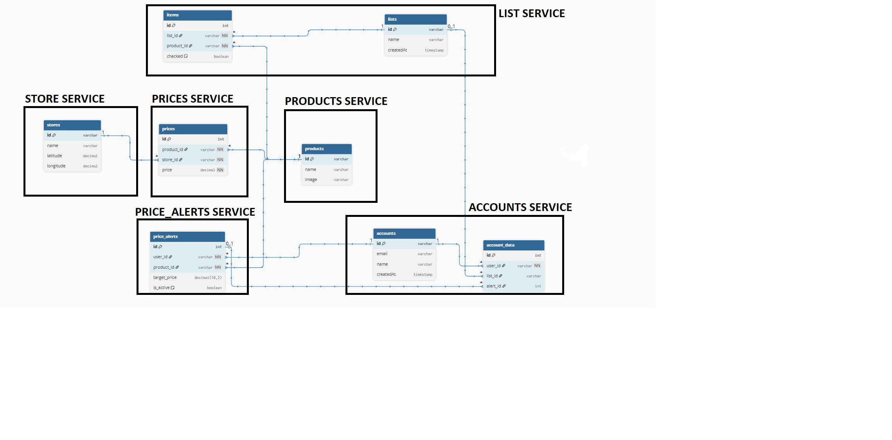

-> Formas de tratar autenticação/validação de acesso nos serviços (ex. Usar algo como o Spring (filter, argument resolver), ou ler manualmente do pedido no controller)

-> Como seria implementado a BD (ex: valores pré-colocados, ou usar API já existente), SQL recomendado (ex: jdbi, jdbc, etc...)

-> Como tratar concorrência no dotnet

-> Onde guardamos os diferentes artefactos, sendo que vêm de repos diferentes (Artifact Registry)

-> Depois de guardados, será necessário criar uma imagem de todos (Build Image)? quando usar o nginx (Deploy Containers)?

-> O que seria Build Mobile ?

-> De que forma funciona a transformação de White Label para Custom

